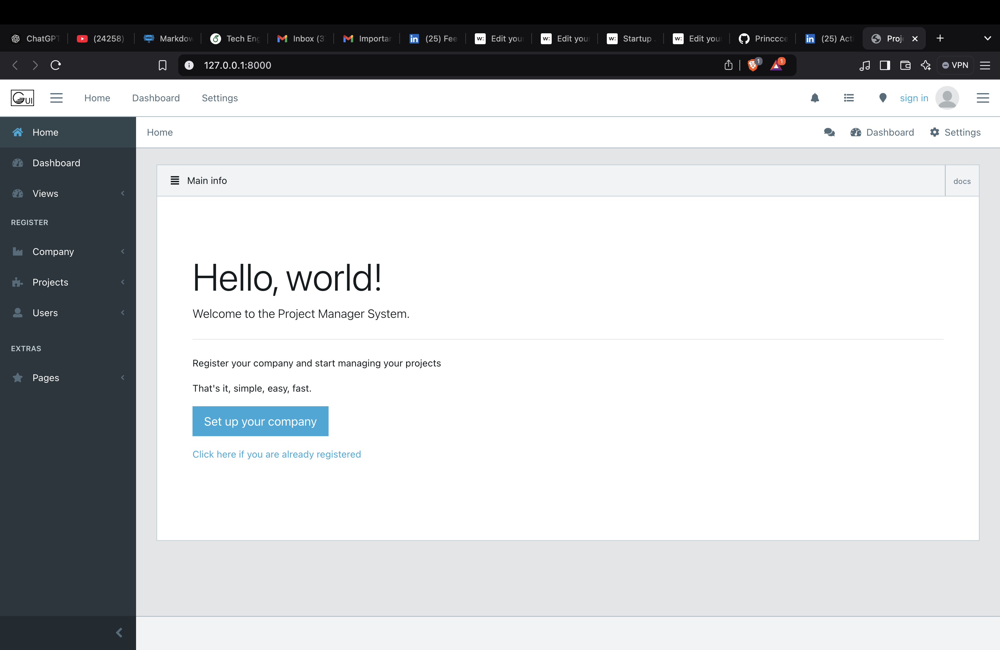

# Project Management System

## Overview
This Project Management System is designed to help teams/organistaions to plan, track, and manage their projects efficiently. It provides features such as task assignment, progress tracking, and collaboration tools.

## Features
- Task assignment and tracking
- Project timelines and milestones
- Team collaboration tools
- Progress reports and analytics
- User authentication and roles

## Installation

To install and run the project locally, follow these steps:

1. Clone the repository in a folder say Project_manager:
    ```bash
    git clone https://github.com/Princccee/Project_management_system
    ```
2. Create a virtual enironment and actiavte it:
    ```bash
    pyton3 -m venv .venv
    source .venv/bin/activate
    ```
3. Install dependencies:
    ```bash
    pip install requirements.txt
    ```
4. Start the development server:
    ```bash
    cd src
    python manage.py runserver
    ```

## Usage
1. Open your browser and navigate to `http://localhost:8000`.
2. Register a new account or log in with existing credentials.
3. Create a new project and start adding tasks.
4. Assign tasks to team members and set deadlines.
5. Track progress and collaborate with your team.

## Contributing
We welcome contributions from the community. To contribute, please follow these steps:

1. Fork the repository.
2. Create a new branch:
    ```bash
    git checkout -b feature/your-feature-name
    ```
3. Make your changes and commit them:
    ```bash
    git commit -m 'Add some feature'
    ```
4. Push to the branch:
    ```bash
    git push origin feature/your-feature-name
    ```
5. Open a pull request.

<!-- ## License
This project is licensed under the MIT License. See the [LICENSE](LICENSE) file for details. -->

## Contact
For any questions or feedback, please contact us at [princceekumar07@gmail.com](mailto:email@example.com).
